# Autonomous Waitress Robot Using LiDAR
### Technological University Mandalay  
**Department of Mechatronics Engineering**

**Supervised by:** Daw Su Myat Hlaing  
**Candidate:** Mg Kyi Lwin Han  

---

## 🔗 Table of Contents
- [Abstract](#abstract)
- [Introduction](#1-introduction)
- [Methodology](#2-methodology)
- [Overall Block Diagram](#3-overall-blockdiagram)
- [Overall Flowchart](#4-overall-flowchart)
- [Pins Connection](#5-pins-connection)
- [Test and Results](#6-test-and-results)
- [Conclusion](#7-conclusion)

---

## Abstract
This thesis aims to simulate and construct a ROS2-based autonomous waitress robot capable of delivering ordered items from a web-based menu to respective tables while avoiding static and dynamic obstacles.  
The system mainly uses **ROS 2**, **SLAM Toolbox**, **Nav2**, **URDF**, and **Gazebo** simulation.

The robot performs well in simulation and shows acceptable performance in real-world scenarios, although no image-processing method is used and wheel slipping occurs on uneven or sloped surfaces.

---

## 1. Introduction
The goal of this thesis is to address labor shortages in the restaurant industry by implementing a fully autonomous robotic waitress capable of navigation, delivery, and integration with a web-based ordering system.

### **Aims & Objectives**
- Design a differential-drive mobile robot platform using Raspberry Pi 5 and Arduino Uno.
- Implement SLAM using a LiDAR sensor for restaurant mapping.
- Develop autonomous navigation using the ROS 2 Nav2 stack.
- Simulate the system in Gazebo and RViz2.
- Create a QR-code-based web ordering system.
- Evaluate obstacle avoidance and path-following performance.

---

## 2. Methodology
This system uses SLAM to generate occupancy grid maps, combining wheel encoder data for odometry and 360-degree LiDAR measurements (RP-LIDAR A1) for drift correction.  
Based on the generated map:

- **Global & Local Costmaps** are created  
- **A\*** plans the shortest path  
- **DWA** generates real-time velocity commands  
- Real-time laser data handles dynamic obstacle avoidance.

---

## 3. Overall Blockdiagram
The overall block diagram is as illustrated follow:
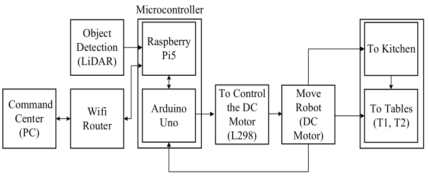

---

## 4. Overall Flowchart
The overall flowchart is as shown below:
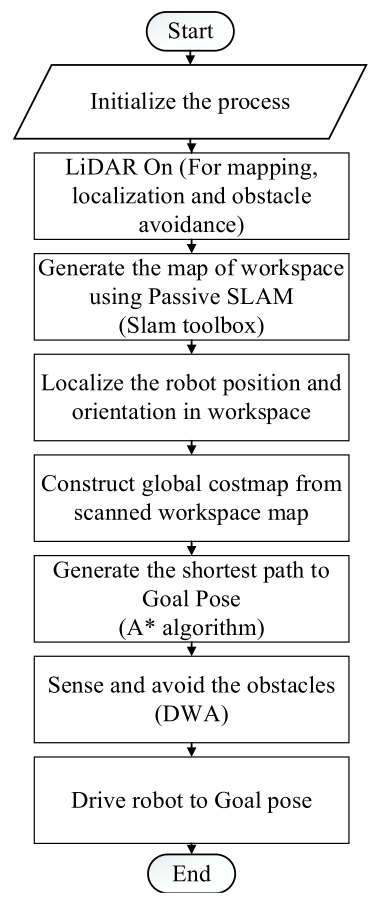

---

## 5. Pins Connection
The pin connections between hardware component are as follow:

---

## 6. 3D Design and Real Robot
The prototype is designed in SolidWorks.
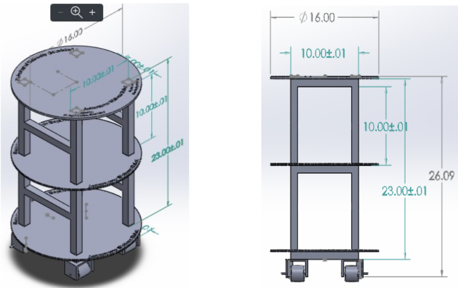  

The real robot used light-weight aluminum hollow as main frame chassis, hold tight by 12mm bolts and nuts, and PVC plates are cut by a CNC machine.
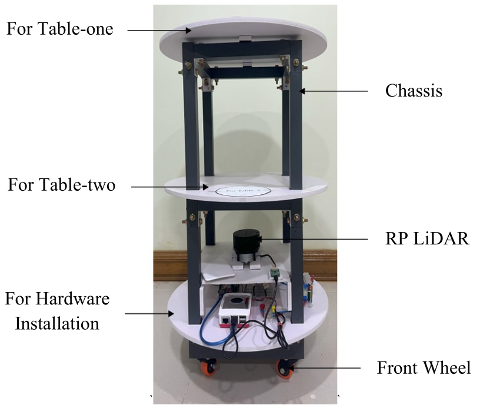

---

## 7. Tests and Results
### 7.1 Simulated Robot

The simulated robot in Gazebo work well without any error, in generating map and navigation in the workspce. 
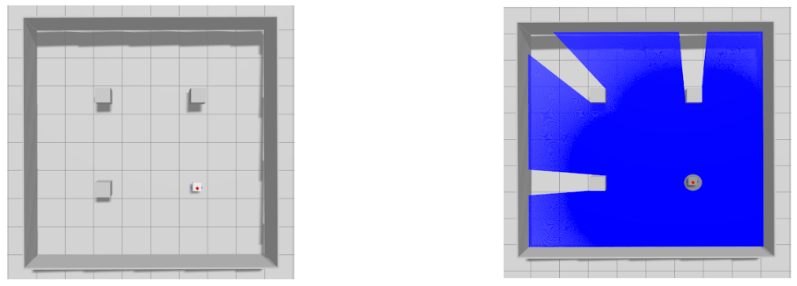
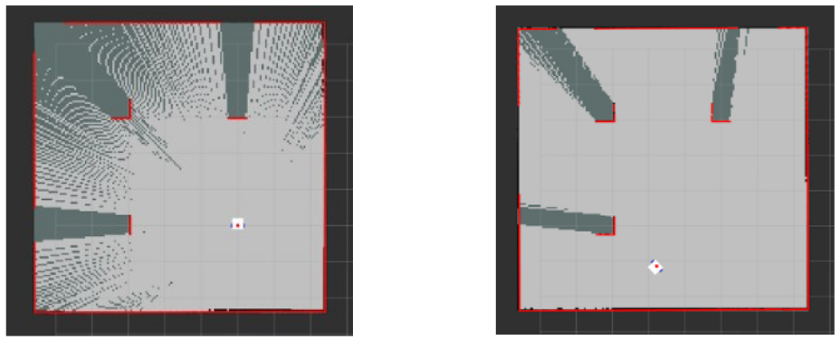
  

The robot use A* algorithm in path planning to the shortest path to destination based on global costmap, whereas Dynamic Window Approach method calculate velocity commands to follow that path, avoiding dynamic obstacles by creating new trajectory.
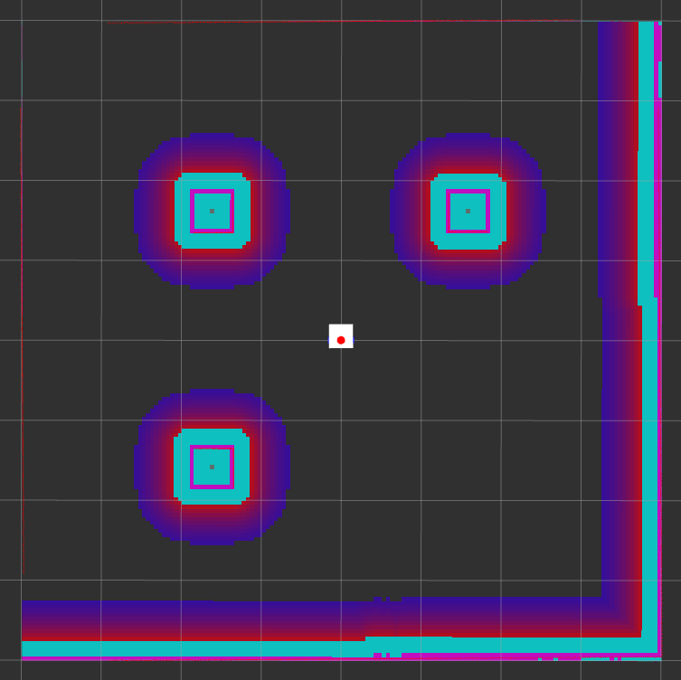
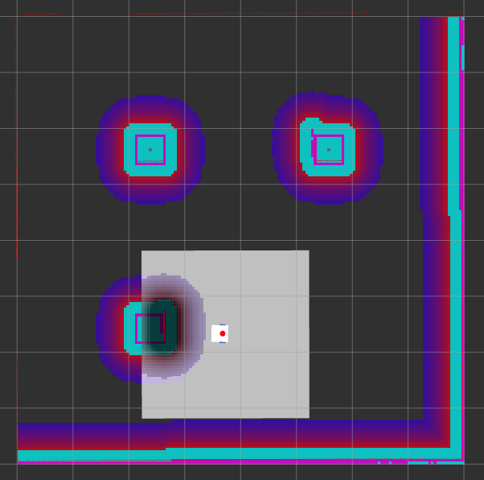  

### 7.2 Real Robot
The real-time performance of the real robot is reliable and test the procedure Initial > Send Goalpose > Travel to Kitchen > Arrive Kitchen > Arrive T1 > Arrive T2 > Arrive Initial.

The Fig. shows 1.6m*1.6m workspace map.
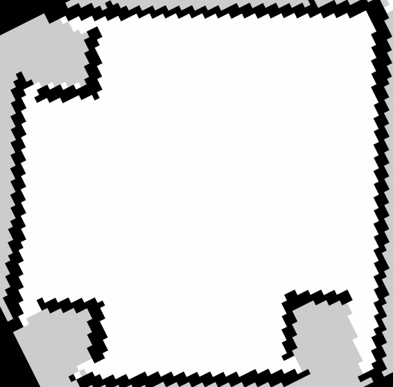

The robot started at initial position.
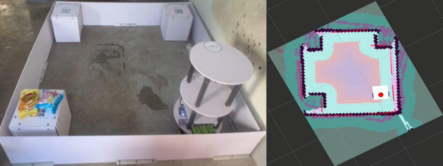

Goalpose to the Kitchen is sent through RViz2  from PC.
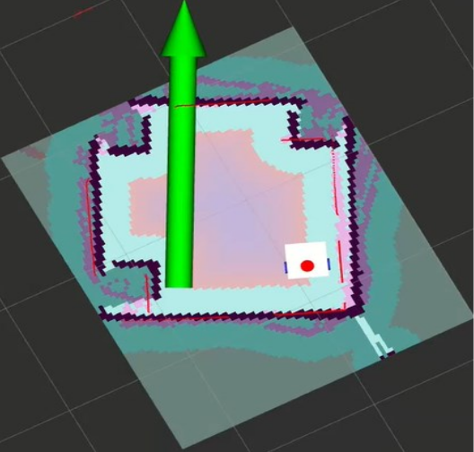

The robot started travelling to the Kitchen.
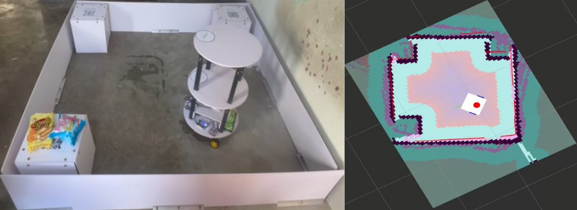

Arriving at the goal point.
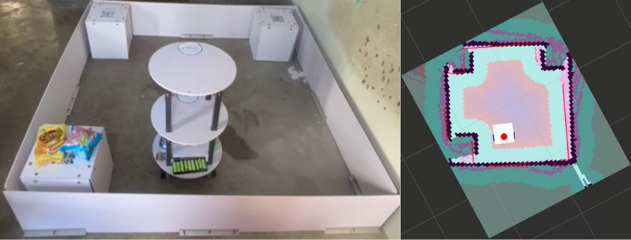

Arriving at the Table-one.
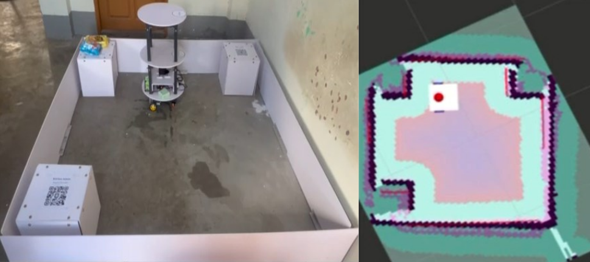

Arriving at the Table-two.
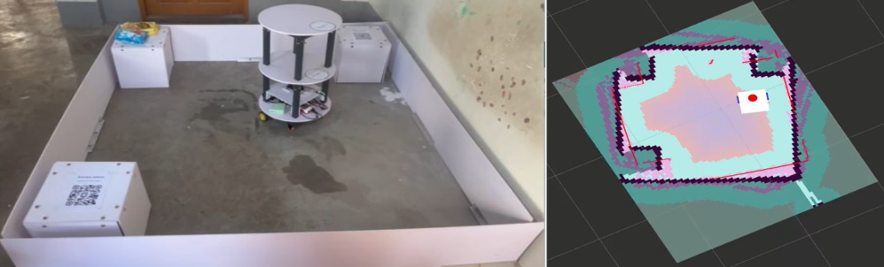

Finally returned to the initial position.
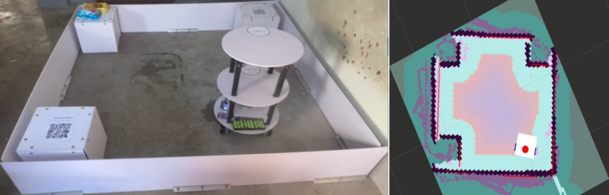

---

## 8. Conclusion

---