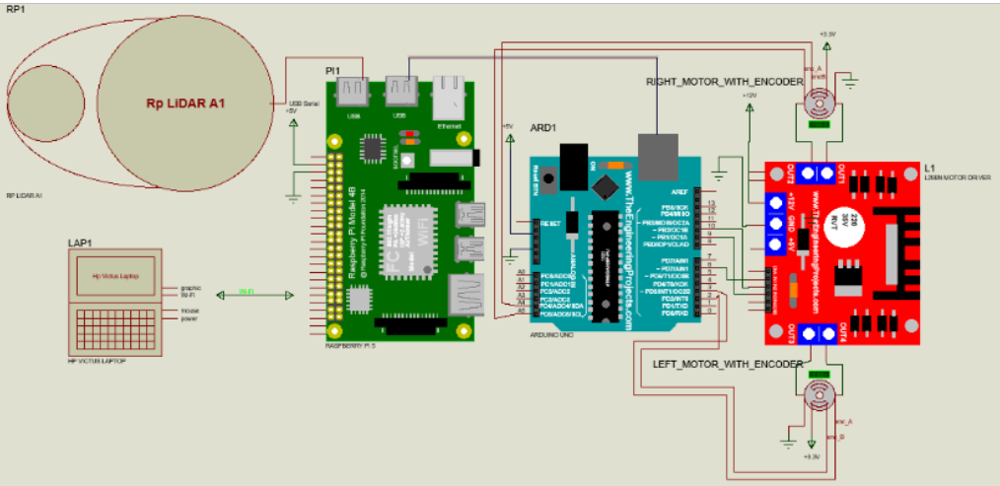

# Autonomous Waitress Robot Using LiDAR
### Technological University Mandalay  
**Department of Mechatronics Engineering**

**Supervised by:** Daw Su Myat Hlaing  
**Candidate:** Mg Kyi Lwin Han  

---

## 🔗 Table of Contents
- [Abstract](#abstract)
- [Introduction](#1-introduction)
- [Methodology](#2-methodology)
- [Overall Block Diagram](#3-overall-blockdiagram)
- [Overall Flowchart](#4-overall-flowchart)
- [Pins Connection](#5-pins-connection)
- [Test and Results](#6-test-and-results)
- [Conclusion](#7-conclusion)

---

## Abstract
This thesis aims to simulate and construct ROS2-based autonomous waitress robot capable of delivering ordered items from web-based menu to respective tables avoiding static and dynamic obstacles in real-world environment. 

The system mainly used Robot Operating System 2 (**ROS2**) alongside with **SLAM Toolbox**, **Nav2 stack** for mapping and navigation, and Unified Robot Description Format (**URDF**), Simulation Description Format (**SDF**) for robot description and simulation in **Gazebo**, monitored by ROS Visualization Tool (**RViz2**). This system works really well in simulation and shows acceptable performance in real world application due to environmental and sensory-communication effect. 

However, no image processing method is applied and sometimes slippery on uneven and slope surfaces.The robot performs well in simulation and shows acceptable performance in real-world scenarios, although no image-processing method is used and wheel slipping occurs on uneven or sloped surfaces.

---

## 1. Introduction
The goal of this thesis is to address labor shortages in the restaurant industry by implementing a fully autonomous robotic waitress capable of navigation, delivery, and integration with a web-based QR-Codes ordering system.

### **Aims & Objectives**
The aim of this thesis is to implement and control an autonomous waitress
robot in real world, delivering safely and reliably some meal from kitchen to designated
tables. The objectives of this system are as follow;
- To design a differential-drive mobile robot platform with Raspberry Pi5
and Arduino Uno microcontroller.
- To implement Simultaneous Localization and Mapping (SLAM)
algorithm using LiDAR for restaurant mapping.
- To develop autonomous navigation using ROS2 Nav2 stack.
- To simulate and demonstrate the real time operation of the system in Rviz2
on PC.
- To construct QR code scan able web-based restaurant order handling
system.
- To evaluate robot performance in obstacle avoidance and path-following
tasks.

---

## 2. Methodology
This system uses SLAM to generate occupancy grid maps, combining wheel encoder data for odometry and 360-degree LiDAR measurements (RP-LIDAR A1) for drift correction.  
Based on the generated map:

- **Global & Local Costmaps** are created  
- **A\*** plans the shortest path  
- **DWA** generates real-time velocity commands  
- Real-time laser data handles dynamic obstacle avoidance.

---

## 3. Overall Blockdiagram
The overall block diagram is as illustrated follow:

---

## 4. Overall Flowchart
The overall flowchart is as shown below:

---

## 5. Pins Connection
The pin connections between hardware component are as follow:

---

## 6. 3D Design, Real Robot and Real Workspace
The prototype is designed in SolidWorks.
  

The real robot used light-weight aluminum hollow as main frame chassis, hold tight by 12mm bolts and nuts, and PVC plates are cut by a CNC machine.

The real world testing workspace.

---

## 7. Tests and Results
### 7.1 Simulated Robot

The simulated robot in Gazebo ,visualized in RViz2, work well without any error, in generating map and navigation in the workspce. 

Starting robot in Gazebo without and with the Laser scan rays.

Visualizing real time data and mapping using SLAM Toolbox in RViz2.

Scanned simulated map. 

The robot use A* algorithm in path planning to the shortest path to destination based on global costmap, whereas Dynamic Window Approach method calculate velocity commands to follow that path, avoiding dynamic obstacles by creating new trajectory.

### 7.2 Real Robot
The real-time performance of the real robot is reliable and test the procedure Initial > Send Goalpose > Travel to Kitchen > Arrive Kitchen > Arrive T1 > Arrive T2 > Arrive Initial.

The Fig. shows occupancy grid map of 1.6m*1.6m workspace.

The robot started at initial position.

Goalpose to the Kitchen is sent through RViz2 from PC.

The robot started travelling to the Kitchen.

Arriving at the goal point.

Arriving at the Table-one.

Arriving at the Table-two.

Finally returned to the initial position.

---

## 8. Conclusion
The minimal error is present in wheel odometry slipping while moving due to uneven surfaces that make robot estimation and transformation seriously drifted, and eventually misled navigation that can be solved by using great traction tyres. Dispite that the robot show acceptable performance in evenly flatten surfaces.

---